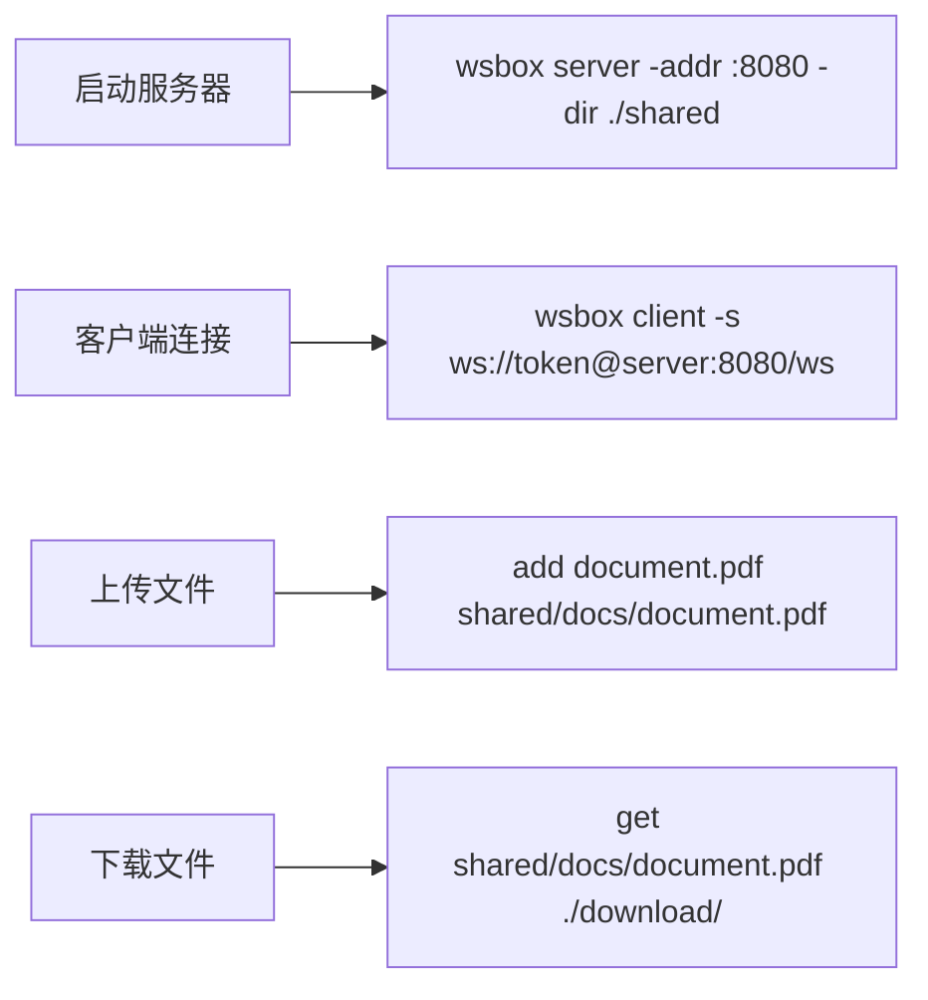
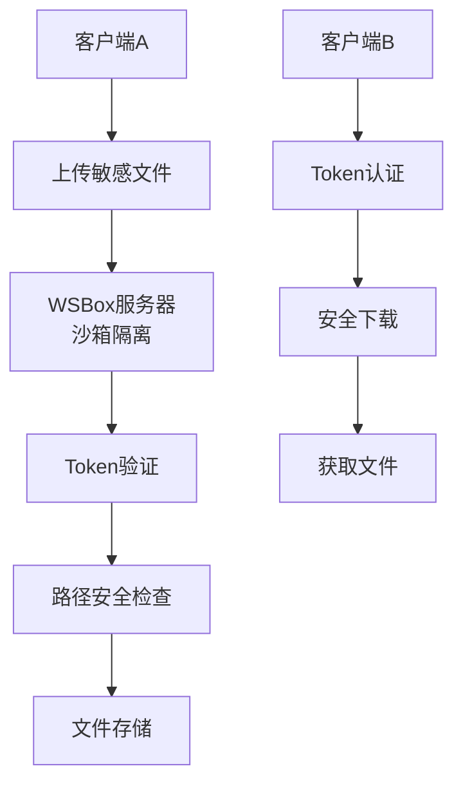
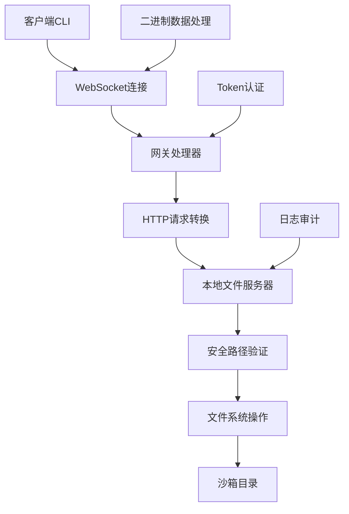
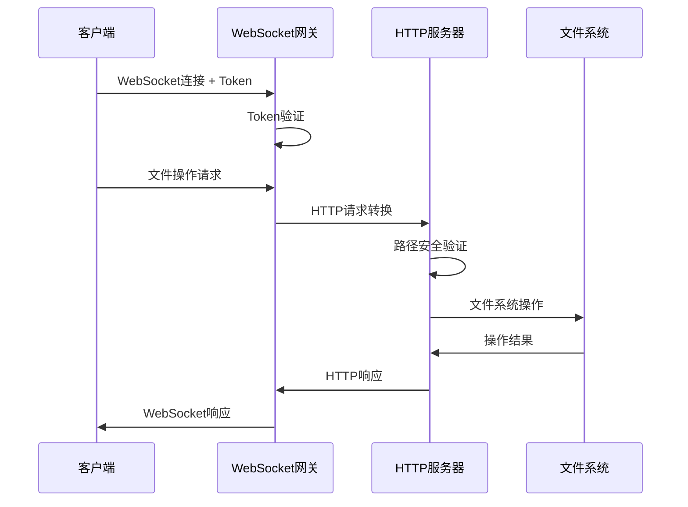

# 🚀 WSBox - 安全文件传输服务器

<p align="center">
  
  
  
  
</p>

> 基于WebSocket的安全文件传输服务器，提供沙箱隔离、路径安全验证和高效文件传输能力

**WSBox**是一个轻量级、高安全性的文件传输服务器，采用WebSocket协议实现双向通信。通过严格的沙箱隔离和路径验证机制，确保文件操作的安全性，防止路径遍历攻击和命令注入漏洞。


## ✨ 核心功能

### 🔒 安全特性
- **沙箱隔离**：所有文件操作限制在指定目录内
- **路径验证**：防止路径遍历攻击（../、..\\等）
- **安全目录创建**：限制目录深度（最多5层），检查危险字符
- **Token认证**：支持固定Token或自动生成Token
- **日志审计**：详细记录所有文件操作和客户端行为

### 📁 文件操作
- **文件上传**：支持任意格式文件上传到指定目录
- **文件下载**：安全下载服务器文件到本地
- **目录浏览**：树状结构显示目录内容
- **递归列表**：支持查看子目录文件结构
- **批量操作**：支持多文件传输操作

### 🌐 网络特性
- **WebSocket协议**：高效双向通信，支持二进制数据传输
- **跨平台支持**：Windows、Linux、macOS全平台兼容
- **网关模式**：内置HTTP网关，统一处理文件请求
- **并发处理**：支持多客户端同时连接

### ⚡ 易用性
- **命令行界面**：简洁直观的CLI操作
- **树状显示**：美观的目录结构展示
- **实时反馈**：操作状态实时显示
- **帮助系统**：内置详细帮助文档

## 🚀 快速开始

### 安装方式

#### 从源码编译
```bash
# 克隆仓库
git clone https://github.com/your-username/wsbox.git

# 进入项目目录
cd wsbox

# 安装依赖
go mod tidy

# 编译
go build -o wsbox main.go
```

#### 直接下载
```bash
# 下载预编译版本（替换为实际下载链接）
wget https://github.com/your-username/wsbox/releases/latest/download/wsbox-linux-amd64
chmod +x wsbox-linux-amd64
mv wsbox-linux-amd64 wsbox
```

### 基础使用

#### 启动服务器
```bash
# 使用默认配置启动
wsbox server

# 自定义配置启动
wsbox server -addr :8080 -dir ./files -token mysecrettoken

# 查看帮助
wsbox help
```

#### 客户端操作
```bash
# 列出根目录文件
wsbox client -s ws://token@server:8080/ws list

# 列出指定目录
wsbox client -s ws://token@server:8080/ws list uploads/

# 上传文件
wsbox client -s ws://token@server:8080/ws add local.txt remote.txt

# 下载文件
wsbox client -s ws://token@server:8080/ws get remote.txt local.txt
```

## 🖥️ 命令详解

### 服务器命令
```bash
wsbox server [flags]

Flags:
  -addr string    服务器监听地址 (默认 ":8080")
  -dir string     文件存储目录 (默认 ".")
  -token string   访问Token (留空自动生成)
```

### 客户端命令
```bash
wsbox client [flags] <command> [args...]

Flags:
  -s string    WebSocket服务器地址 (默认 "ws://127.0.0.1:8080/ws")

Commands:
  list [dir]              列出目录内容（树状结构）
  add <local> [remote]    上传文件到服务器
  get <remote> [local]    从服务器下载文件
  help                    显示帮助信息
```

## 🛠️ 使用示例

### 场景1：搭建文件共享服务器


### 场景2：安全文件传输


### 场景3：目录结构浏览
```bash
# 服务器目录结构
project_files/
├─ documents/
│  ├─ readme.txt
│  └─ manual.pdf
├─ images/
│  ├─ logo.png
│  └─ banner.jpg
└─ config/
   └─ settings.json

# 客户端查看
$ wsbox client -s ws://token@server:8080/ws list
project_files/
├─ documents/
├─ images/
└─ config/

$ wsbox client -s ws://token@server:8080/ws list documents/
documents/
├─ readme.txt
└─ manual.pdf
```

## 💡 安全机制详解

### 路径安全验证
| 攻击类型 | 防护机制 | 示例 |
|----------|----------|------|
| **路径遍历** | 清理和验证路径 | `../../../etc/passwd` → 被拒绝 |
| **绝对路径** | 强制相对路径 | `/etc/passwd` → 转换为相对路径 |
| **符号链接** | 检查最终路径 | 确保在沙箱内 |
| **危险字符** | 字符过滤 | `<>:"|?*` → 被拒绝 |

### 目录创建安全
```go
// 安全检查示例
func secureCreateDir(dirPath, rootPath string) error {
    // 1. 限制目录深度（最多5层）
    if depth > 5 { return error }
    
    // 2. 检查危险字符
    if containsDangerousChars(dirPath) { return error }
    
    // 3. 确保在沙箱内
    if !withinSandbox(dirPath, rootPath) { return error }
    
    // 4. 逐级创建并验证
    return createDirSafely(dirPath)
}
```

### Token认证机制
1. **固定Token**：管理员预设Token，适用于生产环境
2. **自动生成**：服务器启动时生成32位随机Token
3. **Bearer认证**：使用HTTP Authorization头传输
4. **连接验证**：每个WebSocket连接都需要Token验证

## 🧩 技术架构

### 系统架构


### 核心组件
1. **WebSocket网关**：处理客户端连接和协议转换
2. **HTTP文件服务器**：处理实际的文件操作
3. **安全验证模块**：路径验证和权限检查
4. **日志系统**：记录所有操作和安全事件
5. **CLI界面**：提供用户友好的命令行接口

### 数据流程


## 📊 性能特性

### 传输性能
- **二进制传输**：WebSocket二进制模式，保证数据完整性
- **流式处理**：大文件分块传输，降低内存占用
- **并发支持**：多客户端同时操作，无阻塞设计
- **断点续传**：支持大文件传输中断恢复（规划中）

### 安全性能
- **零拷贝**：直接内存操作，提高传输效率
- **路径缓存**：安全路径验证结果缓存
- **日志异步**：异步日志写入，不影响传输性能
- **内存控制**：严格控制内存使用，防止DoS攻击

## 🔧 配置选项

### 服务器配置
```bash
# 环境变量配置
export WSBOX_ADDR=":8080"           # 监听地址
export WSBOX_DIR="./files"          # 存储目录
export WSBOX_TOKEN="your-token"     # 访问Token
export WSBOX_LOG_LEVEL="info"       # 日志级别
export WSBOX_MAX_FILE_SIZE="100MB"  # 最大文件大小
```

### 客户端配置
```bash
# 配置文件 ~/.wsbox/config.yaml
server: "ws://token@server:8080/ws"
timeout: 30s
retry: 3
buffer_size: 8192
```

## 🚨 安全建议

### 生产环境部署
1. **使用HTTPS/WSS**：启用TLS加密传输
2. **强Token策略**：使用复杂Token，定期更换
3. **防火墙配置**：限制访问IP范围
4. **日志监控**：监控异常访问行为
5. **定期备份**：重要文件定期备份

### 安全最佳实践
```bash
# 1. 使用专用用户运行
sudo useradd -r -s /bin/false wsbox
sudo -u wsbox wsbox server -dir /var/wsbox

# 2. 限制目录权限
chmod 750 /var/wsbox
chown wsbox:wsbox /var/wsbox

# 3. 使用systemd管理
sudo systemctl enable wsbox
sudo systemctl start wsbox
```

## 📜 许可协议

本项目采用 **MIT 许可证** - 详细信息请查看 [LICENSE](LICENSE) 文件。

### 主要条款
| 允许 | 要求 | 禁止 |
|------|------|------|
| ✅ 商业使用 | ❗ 保留版权声明 | 🚫 责任追究 |
| ✅ 修改分发 | ❗ 包含许可副本 | 🚫 商标使用 |
| ✅ 私人使用 | - | 🚫 担保承诺 |

## 🤝 贡献指南

### 开发环境
```bash
# 1. Fork项目并克隆
git clone https://github.com/your-username/wsbox.git

# 2. 创建功能分支
git checkout -b feature/new-feature

# 3. 安装开发依赖
go mod tidy

# 4. 运行测试
go test ./...

# 5. 提交更改
git commit -m "Add new feature"
git push origin feature/new-feature
```

### 代码规范
- 遵循Go官方代码规范
- 添加必要的注释和文档
- 编写单元测试
- 确保安全性检查通过

## 📞 支持与反馈

- **问题报告**：[GitHub Issues](https://github.com/your-username/wsbox/issues)
- **功能请求**：[GitHub Discussions](https://github.com/your-username/wsbox/discussions)
- **安全漏洞**：请私下联系维护者
- **文档改进**：欢迎提交PR改进文档

---

**让文件传输更安全、更简单** - WSBox为您提供企业级的文件传输解决方案 🚀🔒